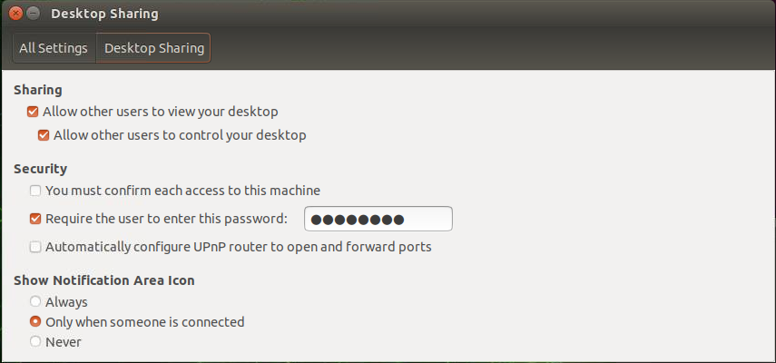

# Jetson Nano: From Flashing to Running computer vision projects
## 1. _Flash the SD card_
There are multiple ways to flash the SD card. I personally recommend the first way using etcher application. 

1. Downloading the official Nvidia Jepack Os File and flash it in the SD card using the etcher application or flash the SD card directly over the jetson in headless mode.
2. Use the Jetson SDK Manager  https://docs.nvidia.com/sdk-manager/install-with-sdkm-jetson/index.html

    ### Required items
   - A PC or Laptop with Ubuntu/Windows/Mac.
   - A SD card preferabbly 32 GB or more.
   - SD card reader if you don't have a card reader in your PC or Laptop
    ### Steps
   - First download the jetpack os file from the official [Nvidia website](https://developer.nvidia.com/embedded/jetpack-sdk-46). (Caution : Choose the correct OS version. There are two versions for Jetson Nano developer. One with 4 GB and another one 2GB ). In this tutorial I have used 4GB version. 
   - Download the [etcher](https://www.balena.io/etcher/) for flashing the os in SD card. 
   - Unzip the Etcher file and use the application to flash the OS into SD card.

## 2. Remove unnecessary stuff from Jetson
**Caution** : This step is essential for only who use 16 GB SD card for flashing. As the OS occupies upto 14 GB of memory. 
The Jetpack official version of contains alot of unwanted stuff which occupies quite some amount of memory.
The below script is modified version taken from here in [gist](https://gist.github.com/adujardin/c0ee25cfb343ea5b6d17ea88ec6634ac).

```commandline
./1_clean_jetson.sh
```
## 3. Install basics script
The basics script install the nano, curl, python3-dev, python-pip3, python setuptools, jetson stats for the CPU and GPU usage monitoring. 
```commandline
./2_basics_install.sh
```

## 4. Increase SWAP size 
Increasing the SWAP is required when your projects have consumes alot of RAM memory, in addition it is will be helpful in installation of opencv from source.
This script is taken from [here](https://wp.me/p7ZgI9-1ac)
Install a swap file on the NVIDIA Jetson Nano Developer Kit. This should help with memory pressure issues.

   ### Setup Swap File
To install swap memory run this command in the terminal.

```commandline
./installSwapFile.sh
```
The details of the swap script is described below. 
> installSwapFile.sh - Create a swap file ; Use on external media like USB drive or SSD

> usage: installSwapFile.sh [[[-d directory ] [-s size] -a] | [-h]]
>
> -d | --dir [directoryname]   Directory to place swapfile (defaults to /mnt)
>
> -s | --size [gigabytes] (defaults to 8 )
>
> -a | --auto  Enable swap on boot in /etc/fstab (default: "Y")
>
> -h | --help  This message
>
> Defaults to creating a 6GB Swapfile in the current directory
>
> Note: If you enable swap on boot, you should also automount the drive that you're using

### Automount
Automount a device given the label
> autoMount.sh - Automount a device, useful for external media like USB drives

## 5. Remotely connect the Jetson using VNC
Steps to connect the jetson nano using VNC
I have a Desktop PC and a Jetson Nano running in the same network. Here the Jetson and my Desktop PC is connected to same network

#### Steps

Jetson Desktop sharing needs a bit of a tweak.
1. First open the terminal and paste the below command
```commandline
sudo nano /usr/share/glib-2.0/schemas/org.gnome.Vino.gschema.xml
```
2. Copy and paste the below code in the structure of keys in the xml file. After pasting hit Ctrl + O to write and Ctrl + X for exit  
```shell
<key name='enabled' type='b'>
<summary>Enable remote access to the desktop</summary>
<description>
If true, allows remote access to the desktop via the RFB
protocol. Users on remote machines may then connect to the
desktop using a VNC viewer.
</description>
<default>true</default>
</key>
```
3. Now compile the schemas for using the Gnome using the below command

```commandline
sudo glib-compile-schemas /usr/share/glib-2.0/schemas
```
4. Now go to jetson applications , looks for desktop sharing. click and launch 
   
   - Now check mark both the "Allow other users to view your desktop" and "Allow other users to control your desktop"
   - Then give a password in the place, "Require the user to enter this password" (Remember this password to connect from host PC)
5. Open ‘startup applications’ using the search box that appears at the top of the screen. Now, click Add at the right of the box, then type ‘Vino’ in the name box, and then in the command box enter /usr/lib/vino/vino-server. 
   Click Save at the bottom right of the box, and then close the app.

6. The final step is to turn off the encryption and prompt. Copy and paste the below command in the jetson terminal. 

```commandline
gsettings set org.gnome.Vino require-encryption false
gsettings set org.gnome.Vino prompt-enabled false
```
7 . Now reboot the jetson 

```commandline
sudo reboot
```
 8. Since we added the vnc server in startup application it will run automatically after the boot. In order to check the VNC server is up and running
copy and paste the below command to check for a similar output
```commandline
jetson@Pratheeban:~$ ps -ef|grep vnc
jetson   13640 13519  0 21:49 pts/1    00:00:00 grep --color=auto vnc
```
9. Now look for the ip address in jetson,  using the below command. you will see a long list of ip address used by the jetson.
Look for the one with wlan0 as I am using the wifi network.

```commandline
ifconfig
wlan0: flags=4163<UP,BROADCAST,RUNNING,MULTICAST>  mtu 1500
inet 192.168.0.30  netmask 255.255.255.0  broadcast 192.168.0.225
```
`192.168.0.30 is my ipaddress of the jetson 
`
```commandline
ps -ef | grep vnc
```
Now go to your host PC install remmina.


## Install Jupyter & Jupyter lab